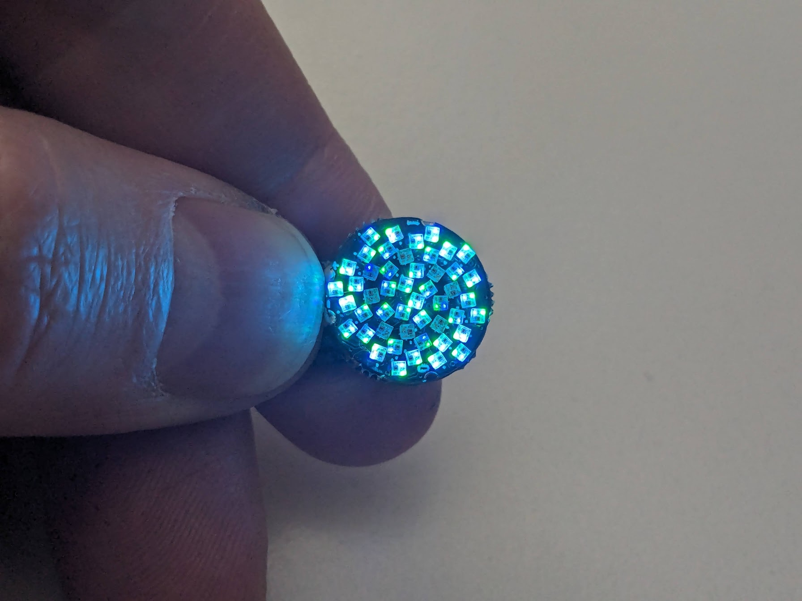

# Fibonacci48 x 14mm Demo

Demo Arduino firmware for Fibonacci48 x 14mm

More info: https://evilgeniuslabs.org/Fibonacci4814mm

### Dependencies

I developed and tested this sketch with the following board and library versions. The sketch may work with other versions, but these are known to work.

Board: Arduino Pro or Pro Mini

Libraries:
* FastLED v3.5.0: https://github.com/FastLED/FastLED